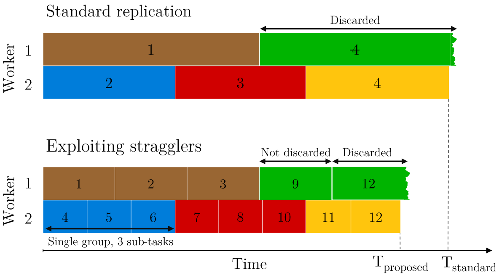

---

## About

I obtained both my PhD and MASc degrees from the Department of Electrical and Computer Engineering at the University of Toronto, Canada, in 2024 and 2018, respectively. During this period, I conducted research on distributed optimization, machine learning, and multi-user information theory under the supervision of <a href="https://www.ece.utoronto.ca/people/draper-s"><strong>Prof. Stark C. Draper</strong></a>.

I received my B.Sc. degree in 2014 from the University of Moratuwa, Sri Lanka. From 2014 to 2016 I worked with <a href="https://www.linkedin.com/company/lsegtechnology/about/"><strong>LSEG Technology</strong></a> (formerly known as MillenniumIT), Sri Lanka, focusing on the development of technology for Stock Market Surveillance.

Feel free to visit my <a href="https://www.linkedin.com/in/thadikari"><strong>Linkedin</strong></a> and <a href="https://www.github.com/thadikari"><strong>Github</strong></a> pages.

I am an enthusiast of rephotography, capturing then-and-now photos. Some selected items from my collection are posted <a href="https://www.instagram.com/nostalgicapture"><strong>here</strong></a>.

 

---

## Selected Projects + Publications

___Exploiting Stragglers in Distributed Computing Systems with Task Grouping___
&nbsp;\-&nbsp; Published in [TSC '24](https://ieeexplore.ieee.org/xpl/RecentIssue.jsp?punumber=4629386) [[_Paper_](https://ieeexplore.ieee.org/search/searchresult.jsp?newsearch=true&queryText=Exploiting%20Stragglers%20in%20Distributed%20Computing%20Systems%20with%20Task%20Grouping), [_Arxiv_](https://arxiv.org/abs/2411.03645)]

A method is proposed for exploiting stragglers in the context of general workloads, by generalizing standard replication. Evaluations on real-world datasets and clusters show up to 30% time savings. | 

___Common Function Reconstruction with Information Swapping Terminals (CFR)___
&nbsp;\-&nbsp; Presented at [ISIT July '24](https://2024.ieee-isit.org/home) [[_Paper_](https://ieeexplore.ieee.org/document/10619246)]

An achievability and a converse for the the CFR problem is presented, where two terminals swap information and they both reconstruct deterministic functions of sources, which are identical with high probability. | 

___Straggler Exploitation in Distributed Computing Systems with Task Grouping___
&nbsp;\-&nbsp; Presented at [Allerton Conf. Sep '23](https://allerton.csl.illinois.edu) [[_Paper_](https://ieeexplore.ieee.org/document/10313511), [_Slides_](/docs/straggler_allerton23.pdf)]

A method is proposed for exploiting work done by stragglers, nodes that randomly become slow in large compute clusters. The proposed method offers up to 30% time savings compared to a baseline. | 

___Bounds for the Rate Distortion Region of 'Two-Terminal Common Function Reconstruction (CFR)' Problem___
&nbsp;\-&nbsp; Presented at [NASIT June '23](https://nasit.seas.upenn.edu) [[_Poster_](/docs/bounds_nasit23.pdf)]

An achievability and a converse on the rate distortion region of the CFR problem are obtained. In CFR problem two terminals approximate a function output, and they must be identical with high probability. | 

___Two-Terminal Source Coding With Common Sum Reconstruction (CSR)___
&nbsp;\-&nbsp; Presented at [ISIT June '22](https://dblp.org/db/conf/isit/isit2022.html) [[_Paper_](https://ieeexplore.ieee.org/document/9834771), [_Slides_](/docs/two-terminal_isit22.pdf), [_Arxiv_](https://arxiv.org/abs/2206.06973)]

An analysis of the CSR problem is presented. In CSR, two terminal want to reconstruct the sum of two correlated sources and they must be identical with high probability. | 

___Compressing Gradients by Exploiting Temporal Correlation in Momentum-SGD___
&nbsp;\-&nbsp; Published in [JSAIT '21](https://ieeexplore.ieee.org/xpl/RecentIssue.jsp?punumber=8700143) [[_Paper_](https://ieeexplore.ieee.org/document/9511618), [_Arxiv_](https://arxiv.org/abs/2108.07827)]

A predictive coding-based approach for exploiting memory in consecutive momentum-SGD update vectors. A novel predictor design is proposed for systems with error-feedback. | 

___Exploitation of Temporal Structure in Momentum-SGD for Gradient Compression___
&nbsp;\-&nbsp; Presented at [ISTC Aug '21](https://istc2021.org) [[_Paper_](https://ieeexplore.ieee.org/document/9594251), [_Slides_](/docs/exploitation_istc21.pdf)]

A method is proposed for exploiting the temporal structure in consecutive momentum-SGD updates for systems with and without error-feedback. | 

___Asynchronous Delayed Optimization With Time-Varying Minibatches___
&nbsp;\-&nbsp; Published in [JSAIT '21](https://ieeexplore.ieee.org/xpl/RecentIssue.jsp?punumber=8700143) [[_Paper_](https://ieeexplore.ieee.org/document/9429693), [_Code_](https://github.com/thadikari/anytime_minibatch)]

TensorFlow implementation of SGD on a master-worker system with time-varying minibatch sizes, i.e., when workers complete different amounts of work due to straggling. | 

___Decentralized Optimization with Non-Identical Sampling in Presence of Stragglers___
&nbsp;\-&nbsp; Presented at [ICASSP May '20](https://2020.ieeeicassp.org) [[_Paper_](https://ieeexplore.ieee.org/document/9053329), [_Slides_](/docs/decentralized_icassp20.pdf), [_Arxiv_](https://arxiv.org/abs/2108.11071), [_Code_](https://github.com/thadikari/graph_optimization)]

An analysis on decentralized consensus optimization (e.g. optimization on a graph) when workers sample data from non-identical distributions and perform variable amounts of work due to stragglers (slow nodes). |    

___Efficient Learning of Neighbor Representations for Boundary Trees and Forests___
&nbsp;\-&nbsp; Presented at [CISS Mar '19](https://dblp.org/db/conf/ciss/ciss2019.html) [[_Paper_](https://ieeexplore.ieee.org/document/8693043), [_Slides_](/docs/efficient_ciss19.pdf), [_Arxiv_](https://arxiv.org/abs/1810.11165), [_Code_](https://github.com/thadikari/boundary-training)]

This project builds on the "Differentiable Boundary Trees" algorithm by [Zoran et al.](https://arxiv.org/pdf/1702.08833.pdf) One possible implementation of their algorithm is [_here_](https://github.com/thadikari/differentiable-boundary-trees). | 

___Python/NumPy Implementation of a Few Iterative Decoders for LDPC Codes___&nbsp;&nbsp;
[[_Code_](https://github.com/thadikari/ldpc_decoders)]

Includes implementations of min-sum and sum-product algorithms using sparse matrices (`scipy.sparse`), maximum-likelihood (ML) and linear-programming (LP) decoders, and ADMM decoder. | 

  
Hosted on GitHub Pages &mdash; Theme by <a href="https://github.com/orderedlist">orderedlist</a>
